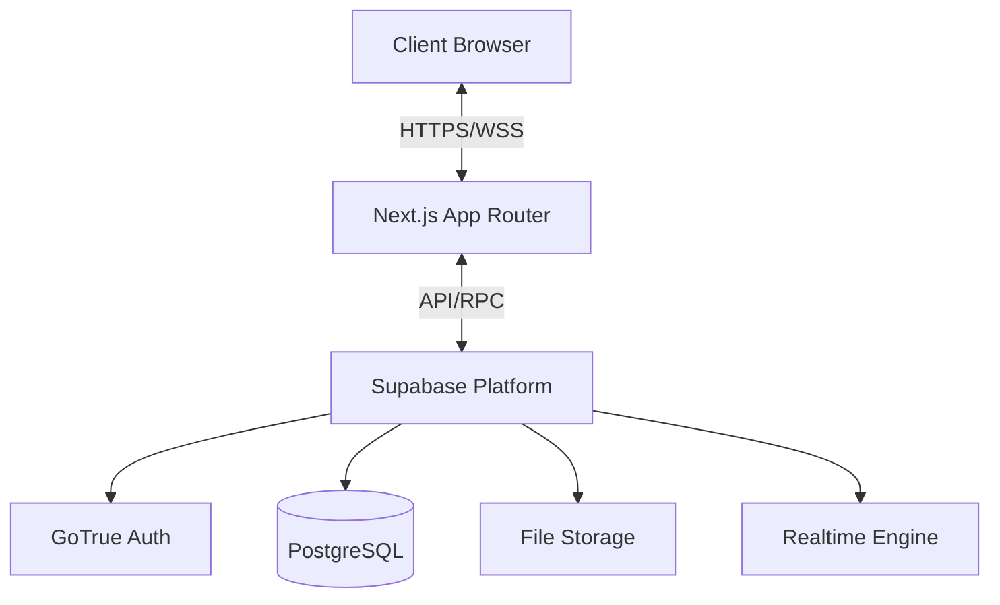

# Swebuk Platform

**Swebuk** (Software Engineering Student Club) is a comprehensive online tech community and management platform designed to connect software engineering students, facilitate collaboration, and streamline academic project management.

It serves as a digital hub where students can join clubs (clusters), collaborate on projects, build professional portfolios, and manage their Final Year Projects (FYP). For staff and administrators, Swebuk provides powerful tools to oversee student progress, manage events, and maintain the system's integrity.

---

## 📚 Documentation Hub

While this README provides a comprehensive overview, detailed documentation can be found here:

| Document | Description |
|----------|-------------|
| **[FYP Module Guide](./FYP_README.md)** | Dedicated documentation for the Final Year Project management system. |
| **[System Architecture](./system%20design%20and%20architecture.md)** | Deep dive into the architectural decisions, diagrams, and data flow. |
| **[Implementation Roadmap](./IMPLEMENTATION_ROADMAP.md)** | Future plans and current progress status. |
| **[Migration Guide](./FYP_MIGRATION_GUIDE.md)** | Instructions for database migrations. |

---

## ✨ Key Features

### 🎓 For Students
*   **Cluster Participation**: Browse and join "Clusters" (special interest groups/clubs) to collaborate with peers.
*   **Project Collaboration**: Create personal projects or join cluster-based initiatives. Includes request/approval workflows.
*   **Portfolio Building**: Maintain a professional profile with academic details, links (GitHub/LinkedIn), and project history.
*   **Final Year Project (FYP)**: (Level 400 only) dedicated module to submit proposals, track progress, upload reports, and receive supervisor feedback.
*   **Blogging**: Write and share technical blog posts (subject to approval).

### 👨‍🏫 For Staff & Supervisors
*   **Cluster Management**: Oversee assigned clusters, approve projects, and moderate content.
*   **FYP Supervision**: Review student proposals, provide feedback, grade submissions, and track thesis progress.
*   **Event Management**: Create and manage events, track registration and attendance.
*   **Communications**: Send notifications and announcements to specific groups or the entire community.

### 🛡️ For Administrators
*   **System Oversight**: Complete control over user roles, permissions, and system configurations.
*   **Analytics**: Dashboards for tracking system usage, project completion rates, and supervisor workloads.
*   **User Management**: Promote students, assign staff roles, and manage academic sessions.

---

## 🏗️ System Architecture

The Swebuk platform is built on a modern, scalable **Three-Tier Architecture**:

1.  **Presentation Layer (Frontend)**: Built with Next.js, providing a responsive and interactive user interface.
2.  **Application Layer (Backend)**: Leveraging Supabase for authentication, real-time logic, and serverless functions.
3.  **Data Layer (Database)**: PostgreSQL database with robust Row Level Security (RLS).

### Architectural Diagram (Conceptual)
*(See `system design and architecture.md` for full UML diagrams)*



---

## 💾 Database Design

The system uses a relational database model centered around **Profiles** and their interactions with **Clusters**, **Projects**, and **Academic Sessions**.

### Key Entities
*   **Profiles**: Extended user data linked to Supabase Auth. Includes role (`student`, `lead`, `staff`, `admin`) and academic level.
*   **Clusters**: Student clubs with hierarchical leadership (Lead, Deputy, Staff Manager).
*   **Projects**: Collaborative workspaces with visibility settings and member roles.
*   **FYP Submissions**: Tracks the lifecycle of a final year thesis from proposal to completion.

### Security (Row Level Security)
Data access is strictly controlled via RLS policies:
*   **Students** can only edit their own profiles and view public/cluster-shared data.
*   **Staff** have elevated access to data within their assigned clusters or supervisees.
*   **Admins** have broad access for system management.

---

## 🛠️ Tech Stack

### Frontend
*   **Framework**: [Next.js 14+](https://nextjs.org/) (App Router)
*   **Language**: [TypeScript](https://www.typescriptlang.org/)
*   **Styling**: [Tailwind CSS](https://tailwindcss.com/)
*   **UI Components**: [Shadcn/ui](https://ui.shadcn.com/) (based on Radix UI)
*   **State Management**: React Query, React Context
*   **Forms**: React Hook Form + Zod

### Backend & Infrastructure
*   **Platform**: [Supabase](https://supabase.com/)
*   **Database**: PostgreSQL
*   **Authentication**: Supabase Auth
*   **Storage**: Supabase Storage (for avatars, reports, documents)
*   **Real-time**: Supabase Realtime (for chat and notifications)

---

## 📂 Project Structure

```bash
├── app/
│   ├── dashboard/       # Role-based dashboards (admin, staff, student)
│   │   ├── admin/
│   │   ├── staff/
│   │   └── student/
│   ├── auth/            # Authentication routes
│   └── api/             # API routes
├── components/
│   ├── fyp/             # FYP-specific components
│   ├── ui/              # Reusable UI components (buttons, inputs, etc.)
│   └── ...
├── lib/
│   ├── supabase/        # Supabase client & server utilities
│   └── utils.ts         # Helper functions
├── supabase/
│   └── migrations/      # SQL migration files
├── public/              # Static assets
└── ...
```

---

## 🚀 Getting Started

### Prerequisites
*   Node.js 18+ installed
*   A Supabase project created

### Installation

1.  **Clone the repository**
    ```bash
    git clone https://github.com/your-username/swebuk.git
    cd swebuk
    ```

2.  **Install dependencies**
    ```bash
    npm install
    ```

3.  **Environment Setup**
    Create a `.env.local` file in the root directory:
    ```bash
    cp .env.example .env.local
    ```

    Fill in your Supabase credentials in `.env.local`:
    ```env
    NEXT_PUBLIC_SUPABASE_URL=your_project_url
    NEXT_PUBLIC_SUPABASE_PUBLISHABLE_KEY=your_anon_key
    SUPABASE_SERVICE_ROLE_KEY=your_service_role_key
    ```

4.  **Database Migration**
    Apply the database schema to your Supabase project:
    ```bash
    npx supabase db reset
    # Or push migrations if using remote
    # npx supabase db push
    ```

5.  **Run the application**
    ```bash
    npm run dev
    ```
    Open [http://localhost:3000](http://localhost:3000) with your browser.

---

## 📸 Screenshots

*(Screenshots to be added)*

> **Note**: For a visual walkthrough of the student dashboard and FYP submission process, please refer to the [FYP Quick Start Guide](./FYP_QUICK_START.md).

---

## 🤝 Contributing

We welcome contributions! Please see our [CONTRIBUTING.md](CONTRIBUTING.md) for details on our code of conduct and the process for submitting pull requests.

## 📄 License

This project is licensed under the MIT License - see the [LICENSE.md](LICENSE.md) file for details.
