# Admin Dashboard Documentation

## Overview
The Admin Dashboard provides full control over the Swebuk platform, allowing administrators to manage users, academic sessions, system settings, and oversee all platform activities.

## Use Case Diagram

```mermaid
%%{init: {'theme': 'base', 'themeVariables': { 'primaryColor': '#FF6347', 'edgeLabelBackground':'#ffffff', 'tertiaryColor': '#f4f4f4'}}}%%
graph LR
    %% Styles
    classDef actor fill:#800080,stroke:#333,stroke-width:2px,color:white,font-size:16px;
    classDef usecase fill:#FFA07A,stroke:#CD5C5C,stroke-width:2px,color:black,shape:rect;
    classDef sys fill:#D8BFD8,stroke:#8B008B,stroke-width:2px,color:black,shape:rect;

    %% Actor
    Administrator([🛡️ Admin]):::actor

    %% Use Cases
    subgraph Personal ["👤 Personal"]
        direction TB
        UC3[View Dashboard]:::usecase
        UC13[Access Portfolio]:::usecase
        UC14[Update Profile]:::usecase
        UC15[Upload Picture]:::usecase
        UC10[View Blogs]:::usecase
        UC11[View Events]:::usecase
    end

    subgraph SystemMgmt ["⚙️ System Management"]
        direction TB
        UC23[Manage Users]:::sys
        UC24[Manage Sessions]:::sys
        UC25[System Settings]:::sys
        UC26[Override Actions]:::sys
        UC27[Promote Students]:::sys
        UC28[Assign Roles]:::sys
    end

    subgraph ContentMgmt ["📝 Content Management"]
        direction TB
        UC18[Approve Projects]:::sys
        UC19[Approve Blogs]:::sys
        UC20[Manage Clusters]:::sys
        UC21[Manage Events]:::sys
    end

    %% Connections
    Administrator --> Personal
    Administrator --> SystemMgmt
    Administrator --> ContentMgmt

    %% Direct links
    Administrator --> UC3
    Administrator --> UC23
    Administrator --> UC18
```

## Use Case Descriptions

| ID | Use Case | Description | Preconditions | Postconditions |
|----|----------|-------------|---------------|----------------|
| **UC3** | View Dashboard | User accesses the admin dashboard to view system-wide metrics and alerts. | User is authenticated as admin. | User views admin dashboard. |
| **UC10** | View Blog Posts | User views published blog posts. | User is authenticated. | User has viewed blog posts. |
| **UC11** | View Events | User views available upcoming events. | User is authenticated. | User has viewed available events. |
| **UC13** | Access Portfolio | User accesses their portfolio section. | User is authenticated. | User has accessed their portfolio. |
| **UC14** | Update Profile | User updates their profile information. | User is authenticated. | User profile is updated. |
| **UC15** | Upload Profile Picture | User uploads or changes their profile picture. | User is authenticated. | User's profile picture is updated. |
| **UC18** | Approve Projects | Admin approves student project proposals (system-wide). | User is admin and projects require approval. | Project is approved or rejected. |
| **UC19** | Approve Blog Posts | Admin reviews and approves blog posts (system-wide). | User is admin and posts require approval. | Blog post is approved or rejected. |
| **UC20** | Manage Clusters | Admin manages all clusters (create, edit, delete, assign staff). | User is admin. | Cluster management tasks are performed. |
| **UC21** | Manage Events | Admin creates and manages events system-wide. | User is admin. | Event is created and managed. |
| **UC23** | Manage Users | Administrator manages all users (view, edit, promote, demote). | User has administrator role. | User management changes are applied. |
| **UC24** | Manage Academic Sessions | Administrator creates, edits, or archives academic sessions. | User has administrator role. | Academic sessions are managed. |
| **UC25** | Manage System Settings | Administrator configures global system settings. | User has administrator role. | System settings are updated. |
| **UC26** | Override Decisions | Administrator overrides system decisions or staff actions. | User has administrator role. | Decision is overridden. |
| **UC27** | Promote Students | Administrator promotes students to leadership roles (Lead, Deputy). | User has administrator role. | Student is promoted to leadership role. |
| **UC28** | Assign Staff Roles | Administrator assigns roles/permissions to staff members. | User has administrator role. | Staff member has updated roles. |

## Activity Diagram

