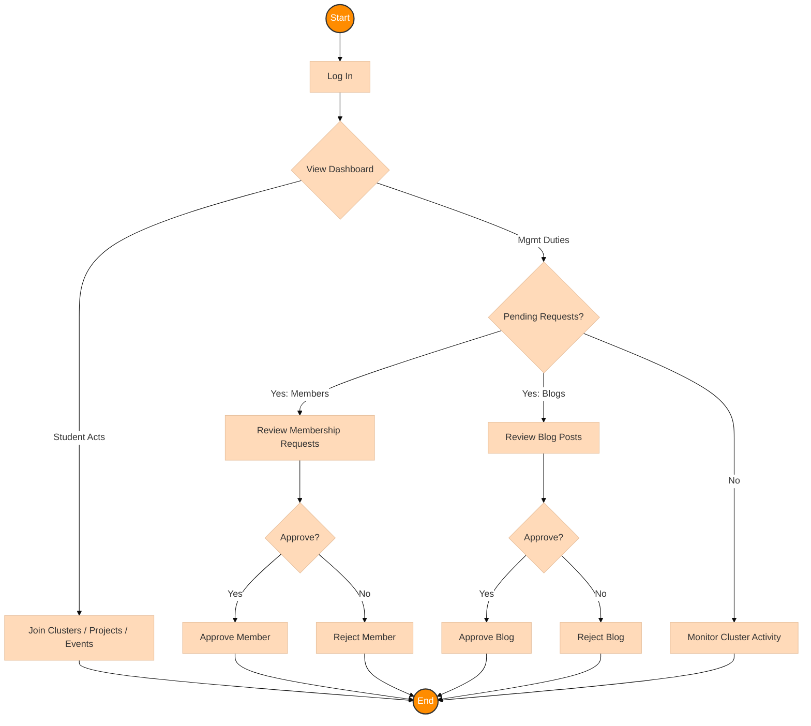

# Deputy Lead Student Dashboard Documentation

## Overview
The Deputy Lead Student Dashboard allows students appointed as deputies to assist the Cluster Lead in managing their cluster. This includes approving members and moderating content, in addition to all standard student functionalities.

## Use Case Diagram

```mermaid
%%{init: {'theme': 'base', 'themeVariables': { 'primaryColor': '#FFDAB9', 'edgeLabelBackground':'#ffffff', 'tertiaryColor': '#f4f4f4'}}}%%
graph LR
    %% Styles
    classDef actor fill:#FF8C00,stroke:#333,stroke-width:2px,color:white,font-size:16px;
    classDef usecase fill:#FFDAB9,stroke:#CD853F,stroke-width:2px,color:black,shape:rect;
    classDef deputy fill:#F0E68C,stroke:#BDB76B,stroke-width:2px,color:black,shape:rect;

    %% Actor
    DeputyLeadStudent([🎖️ Deputy Lead]):::actor

    %% Use Cases
    subgraph DeputyDuties ["🤝 Deputy Duties"]
        direction TB
        UC17[Approve Members]:::deputy
        UC19[Approve Blogs]:::deputy
    end

    subgraph Standard ["🎒 Student Activities"]
        direction TB
        UC3[View Dashboard]:::usecase
        UC4[Browse Clusters]:::usecase
        UC5[Join Clusters]:::usecase
        UC6[Create Projects]:::usecase
        UC7[Browse Projects]:::usecase
        UC8[Join Projects]:::usecase
        UC9[Create Blog]:::usecase
        UC10[View Blogs]:::usecase
        UC11[View Events]:::usecase
        UC12[Join Events]:::usecase
        UC13[Access Portfolio]:::usecase
        UC14[Update Profile]:::usecase
        UC15[Upload Picture]:::usecase
        UC16[Access FYP (L400)]:::usecase
    end
    
    %% Connections
    DeputyLeadStudent --> DeputyDuties
    DeputyLeadStudent --> Standard
    
    %% Direct links
    DeputyLeadStudent --> UC17
    DeputyLeadStudent --> UC3
```

## Use Case Descriptions

| ID | Use Case | Description | Preconditions | Postconditions |
|----|----------|-------------|---------------|----------------|
| **UC17** | Approve Cluster Members | Deputy Lead approves or rejects membership requests for their cluster. | User is Deputy Lead and requests exist. | Membership request is approved or rejected. |
| **UC19** | Approve Blog Posts | Deputy Lead approves blog posts submitted by cluster members. | User is Deputy Lead and posts await approval. | Blog post is approved or rejected. |
| **UC3** | View Dashboard | User accesses the dashboard. Deputies see management tools. | User is authenticated. | User views personalized dashboard. |
| **UC4** | Browse Clusters | User browses available clusters. | User is authenticated. | User has viewed available clusters. |
| **UC5** | Join Clusters | User requests to join other clusters. | User is authenticated. | Membership request is pending. |
| **UC6** | Create Personal Projects | User creates a personal project. | User is authenticated. | Project is created. |
| **UC7** | Browse Projects | User browses available projects. | User is authenticated. | User has viewed projects. |
| **UC8** | Request to Join Projects | User requests to join a project. | User is authenticated. | Join request is pending. |
| **UC9** | Create Blog Posts | User creates a blog post. | User is authenticated. | Post is created. |
| **UC10** | View Blog Posts | User views blog posts. | User is authenticated. | User has viewed posts. |
| **UC11** | View Events | User views events. | User is authenticated. | User has viewed events. |
| **UC12** | Register for Events | User registers for an event. | User is authenticated. | User is registered. |
| **UC13** | Access Portfolio | User accesses portfolio. | User is authenticated. | User has accessed portfolio. |
| **UC14** | Update Profile | User updates profile. | User is authenticated. | Profile is updated. |
| **UC15** | Upload Profile Picture | User uploads profile picture. | User is authenticated. | Picture is updated. |
| **UC16** | Access FYP Module | Level 400 Deputies access FYP module. | User is Level 400. | Access to FYP features. |

## Activity Diagram

