# Lead Student Dashboard Documentation

## Overview
The Lead Student Dashboard allows cluster leads to manage their assigned student cluster. This includes approving members, overseeing projects within the cluster, and moderating content, in addition to all standard student functionalities.

## Use Case Diagram

```mermaid
%%{init: {'theme': 'default'}}%%
graph TB
    subgraph "Lead Student Use Cases"
        UC17[Approve Cluster Members]
        UC18[Approve Projects]
        UC19[Approve Blog Posts]
        UC6[Create Personal Projects]

        subgraph "Standard Student Use Cases"
            UC3[View Dashboard]
            UC4[Browse Clusters]
            UC5[Join Clusters]
            UC7[Browse Projects]
            UC8[Request to Join Projects]
            UC9[Create Blog Posts]
            UC10[View Blog Posts]
            UC11[View Events]
            UC12[Register for Events]
            UC13[Access Portfolio]
            UC14[Update Profile]
            UC15[Upload Profile Picture]
            UC16[Access FYP Module]
        end
    end

    LeadStudent -- "Cluster Management" --> UC17
    LeadStudent -- "Project Management" --> UC18
    LeadStudent -- "Content Moderation" --> UC19
    LeadStudent -- "Project Creation" --> UC6
    LeadStudent -- "Dashboard Access" --> UC3
    LeadStudent -- "Cluster Activities" --> UC4
    LeadStudent -- "Cluster Activities" --> UC5
    LeadStudent -- "Project Activities" --> UC7
    LeadStudent -- "Project Activities" --> UC8
    LeadStudent -- "Content Creation" --> UC9
    LeadStudent -- "Content Consumption" --> UC10
    LeadStudent -- "Event Participation" --> UC11
    LeadStudent -- "Event Participation" --> UC12
    LeadStudent -- "Portfolio Access" --> UC13
    LeadStudent -- "Profile Management" --> UC14
    LeadStudent -- "Profile Management" --> UC15
    LeadStudent -- "Level 400 Only" --> UC16
```

## Use Case Descriptions

| ID | Use Case | Description | Preconditions | Postconditions |
|----|----------|-------------|---------------|----------------|
| **UC17** | Approve Cluster Members | Lead Student approves or rejects membership requests for their cluster. | User is Cluster Lead and requests exist. | Membership request is approved or rejected. |
| **UC18** | Approve Projects | Lead Student approves projects submitted to their cluster. | User is Cluster Lead and projects await approval. | Project is approved or rejected. |
| **UC19** | Approve Blog Posts | Lead Student approves blog posts submitted by cluster members. | User is Cluster Lead and posts await approval. | Blog post is approved or rejected. |
| **UC3** | View Dashboard | User accesses the dashboard. Leads see management tools in addition to student views. | User is authenticated. | User views personalized dashboard. |
| **UC4** | Browse Clusters | User browses available clusters. | User is authenticated. | User has viewed available clusters. |
| **UC5** | Join Clusters | User requests to join other clusters. | User is authenticated. | Membership request is pending. |
| **UC6** | Create Personal Projects | User creates a personal project. | User is authenticated. | Project is created. |
| **UC7** | Browse Projects | User browses available projects. | User is authenticated. | User has viewed projects. |
| **UC8** | Request to Join Projects | User requests to join a project. | User is authenticated. | Join request is pending. |
| **UC9** | Create Blog Posts | User creates a blog post. | User is authenticated. | Post is created. |
| **UC10** | View Blog Posts | User views blog posts. | User is authenticated. | User has viewed posts. |
| **UC11** | View Events | User views events. | User is authenticated. | User has viewed events. |
| **UC12** | Register for Events | User registers for an event. | User is authenticated. | User is registered. |
| **UC13** | Access Portfolio | User accesses portfolio. | User is authenticated. | User has accessed portfolio. |
| **UC14** | Update Profile | User updates profile. | User is authenticated. | Profile is updated. |
| **UC15** | Upload Profile Picture | User uploads profile picture. | User is authenticated. | Picture is updated. |
| **UC16** | Access FYP Module | Level 400 Leads access FYP module. | User is Level 400. | Access to FYP features. |
