# Staff Dashboard Documentation

## Overview
The Staff Dashboard empowers faculty and staff members to manage student clusters, oversee projects, create events, and supervise Final Year Projects (FYP).

## Use Case Diagram

```mermaid
%%{init: {'theme': 'base', 'themeVariables': { 'primaryColor': '#ADD8E6', 'edgeLabelBackground':'#ffffff', 'tertiaryColor': '#f4f4f4'}}}%%
graph LR
    %% Styles
    classDef actor fill:#FF4500,stroke:#333,stroke-width:2px,color:white,font-size:16px;
    classDef usecase fill:#ADD8E6,stroke:#4682B4,stroke-width:2px,color:black,shape:rect;
    classDef manage fill:#98FB98,stroke:#2E8B57,stroke-width:2px,color:black,shape:rect;

    %% Actor
    Staff([👨‍🏫 Staff]):::actor

    %% Use Cases
    subgraph Personal ["👤 Personal Management"]
        direction TB
        UC3[View Dashboard]:::usecase
        UC13[Access Portfolio]:::usecase
        UC14[Update Profile]:::usecase
        UC15[Upload Picture]:::usecase
        UC10[View Blogs]:::usecase
        UC11[View Events]:::usecase
    end

    subgraph Management ["🛠️ Management"]
        direction TB
        UC20[Manage Clusters]:::manage
        UC21[Manage Events]:::manage
        UC22[Supervise FYP]:::manage
    end

    subgraph Approvals ["✅ Approvals"]
        direction TB
        UC18[Approve Projects]:::manage
        UC19[Approve Blogs]:::manage
    end

    %% Connections
    Staff --> Personal
    Staff --> Management
    Staff --> Approvals

    %% Direct links for clarity
    Staff --> UC3
    Staff --> UC20
    Staff --> UC18
```

## Use Case Descriptions

| ID | Use Case | Description | Preconditions | Postconditions |
|----|----------|-------------|---------------|----------------|
| **UC3** | View Dashboard | User accesses the staff dashboard to view relevant information and metrics. | User is authenticated as staff. | User views personalized dashboard. |
| **UC10** | View Blog Posts | User views published blog posts. | User is authenticated. | User has viewed blog posts. |
| **UC11** | View Events | User views available upcoming events. | User is authenticated. | User has viewed available events. |
| **UC13** | Access Portfolio | User accesses their portfolio section. | User is authenticated. | User has accessed their portfolio. |
| **UC14** | Update Profile | User updates their profile information. | User is authenticated. | User profile is updated. |
| **UC15** | Upload Profile Picture | User uploads or changes their profile picture. | User is authenticated. | User's profile picture is updated. |
| **UC18** | Approve Projects | Staff member approves student project proposals. | User is authorized and projects require approval. | Project is approved or rejected. |
| **UC19** | Approve Blog Posts | Staff member reviews and approves student blog posts. | User is authorized and posts require approval. | Blog post is approved or rejected. |
| **UC20** | Manage Clusters | Staff member manages assigned clusters (members, activities). | User has staff role and assigned clusters. | Cluster management tasks are performed. |
| **UC21** | Manage Events | Staff member creates and manages events (registrations, attendance). | User has staff role. | Event is created and managed. |
| **UC22** | Supervise FYP | Supervisor reviews and provides feedback on FYP submissions. | User is a supervisor with assigned students. | FYP supervision is performed and recorded. |

## Activity Diagram

