# Student Dashboard Documentation

## Overview
The Student Dashboard is the central hub for all student activities on the Swebuk platform. It provides access to clusters, projects, events, and for Level 400 students, the Final Year Project (FYP) module.

## Use Case Diagram

```mermaid
%%{init: {'theme': 'default', 'themeVariables': { 'mainBkg': '#ffffff', 'primaryColor': '#ffffff', 'edgeLabelBackground':'#ffffff', 'tertiaryColor': '#f4f4f4'}}}%%
graph LR
    %% Styles
    classDef actor fill:#FFD700,stroke:#333,stroke-width:2px,color:black,font-size:16px;
    classDef usecase fill:#E6E6FA,stroke:#9370DB,stroke-width:2px,color:black,shape:rect;
    classDef fyp fill:#FFB6C1,stroke:#FF69B4,stroke-width:2px,color:black,shape:rect;

    %% Actor
    Student([🎓 Student]):::actor

    %% Use Cases
    subgraph Account ["🔐 Account & Profile"]
        direction TB
        UC1[Register Account]:::usecase
        UC2[Complete Profile]:::usecase
        UC14[Update Profile]:::usecase
        UC15[Upload Picture]:::usecase
        UC13[Access Portfolio]:::usecase
    end

    subgraph Core ["💻 Dashboard & Clusters"]
        direction TB
        UC3[View Dashboard]:::usecase
        UC4[Browse Clusters]:::usecase
        UC5[Join Clusters]:::usecase
    end

    subgraph Projects ["🚀 Projects & Content"]
        direction TB
        UC6[Create Projects]:::usecase
        UC7[Browse Projects]:::usecase
        UC8[Join Projects]:::usecase
        UC9[Create Blog]:::usecase
        UC10[View Blogs]:::usecase
        UC11[View Events]:::usecase
        UC12[Join Events]:::usecase
    end
    
    subgraph Level400 ["🎓 FYP Module"]
        direction TB
        UC16[Access FYP]:::fyp
    end

    %% Connections
    Student --> Account
    Student --> Core
    Student --> Projects
    Student --> Level400
    
    %% Implicit connections to internal nodes for layout if needed, 
    %% but connecting to subgraph usually links to first node. 
    %% To ensure flow lines are visible to specific tasks:
    Student --> UC1
    Student --> UC3
    Student --> UC6
    Student --> UC16
```



## Use Case Descriptions

| ID | Use Case | Description | Preconditions | Postconditions |
|----|----------|-------------|---------------|----------------|
| **UC1** | Register Account | A new user creates an account on the Swebuk platform. | User is not registered. | User has a verified account. |
| **UC2** | Complete Academic Profile | A newly registered user completes their academic profile (level, department, etc.). | User has a verified account. | User has a complete academic profile. |
| **UC3** | View Dashboard | User accesses the student dashboard to view relevant information. | User is authenticated as a student. | User views personalized dashboard. |
| **UC4** | Browse Clusters | User browses available clusters (clubs) to join. | User is authenticated. | User has viewed available clusters. |
| **UC5** | Join Clusters | User requests to join a cluster. | User is authenticated and cluster exists. | Membership request is pending approval. |
| **UC6** | Create Personal Projects | User creates a personal project workspace. | User is authenticated. | Project is created and owned by the user. |
| **UC7** | Browse Projects | User browses available public projects. | User is authenticated. | User has viewed available projects. |
| **UC8** | Request to Join Projects | User requests to join a project owned by another user. | User is authenticated and project exists. | Project join request is pending approval. |
| **UC9** | Create Blog Posts | User creates a blog post which may require approval. | User is authenticated. | Blog post is created and saved (may be pending). |
| **UC10** | View Blog Posts | User views published blog posts. | User is authenticated. | User has viewed blog posts. |
| **UC11** | View Events | User views available upcoming events. | User is authenticated. | User has viewed available events. |
| **UC12** | Register for Events | User registers to attend an event. | User is authenticated and event exists. | User is registered for the event. |
| **UC13** | Access Portfolio | User accesses their portfolio section to view projects and achievements. | User is authenticated. | User has accessed their portfolio. |
| **UC14** | Update Profile | User updates their profile information. | User is authenticated. | User profile is updated. |
| **UC15** | Upload Profile Picture | User uploads or changes their profile picture. | User is authenticated. | User's profile picture is updated. |
| **UC16** | Access FYP Module | Final year (Level 400) student accesses the FYP module for thesis management. | User is authenticated and is Level 400. | User has access to FYP features (proposals, reports). |

## Activity Diagram

```mermaid
%%{init: {'theme': 'base', 'themeVariables': { 'mainBkg': '#ffffff', 'primaryColor': '#ffffff', 'primaryTextColor': '#000000', 'primaryBorderColor': '#000000', 'lineColor': '#000000', 'tertiaryColor': '#ffffff', 'edgeLabelBackground':'#ffffff'}}}%%
flowchart TD
    Start((Start)) --> Login[Log In]
    Login --> Profile{Profile Complete?}
    
    Profile -->|No| Setup[Complete Academic Profile]
    Setup --> Dashboard
    Profile -->|Yes| Dashboard{View Dashboard}
    
    Dashboard -->|Clusters| ClusterAct[Join/View Clusters]
    Dashboard -->|Projects| ProjectAct[Create/Join Projects]
    Dashboard -->|Events| EventAct[Register/View Events]
    
    Dashboard -->|Level 400 Only| FYP{Level 400?}
    FYP -->|Yes| AccessFYP[Access FYP Module]
    AccessFYP --> FYPAction[Submit Proposal / Upload Report]
    FYP -->|No| ViewRestricted[View Restricted Access Msg]
    
    ClusterAct --> End((End))
    ProjectAct --> End
    EventAct --> End
    FYPAction --> End
    ViewRestricted --> End
    
    style Start fill:#fff,stroke:#000,stroke-width:2px
    style End fill:#fff,stroke:#000,stroke-width:2px
```